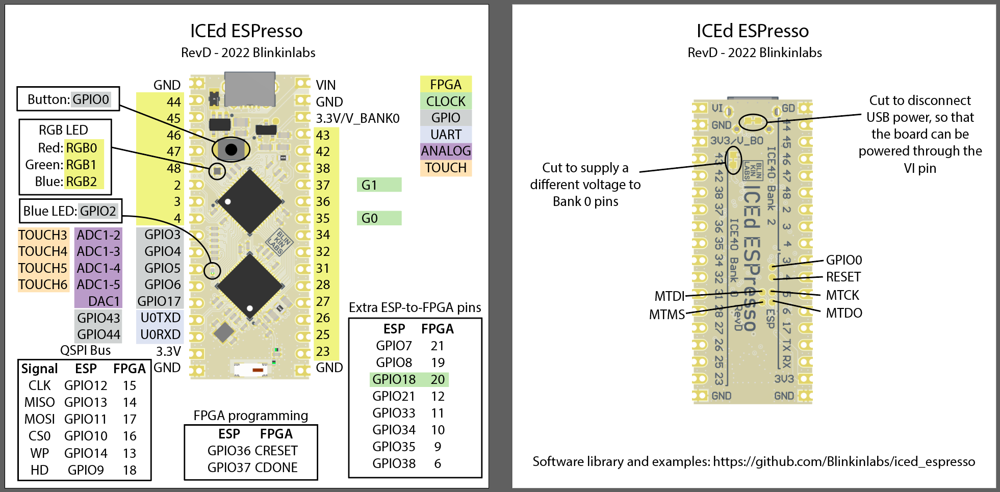

# Iced Espresso by Blinkinlabs

Features:
- 22 FPGA pins
    - 14 w/adjustable voltage reference
    - 3 global clocks
    - 5 difererential pairs
- 7 ESP32-S2 pins
    - 2x UART0 / GPIO
    - 1x DAC / GPIO
    - 4x ADC / GPIO
- 16 FPGA-ESP32 connections
    - 2x programming
    - 6x QSPI bus
    - 1x reference clock
    - 7x GPIO (interrupts, pin sharing)
- ESP32-S2 JTAG signals on test pads
- WiFi
- 4MB SPI flash
- Hardware USB for programming / communication (via ESP32-S2)
- Blue power / status LED
- RGB indicator LED
- Button for boot recovery / app useage
